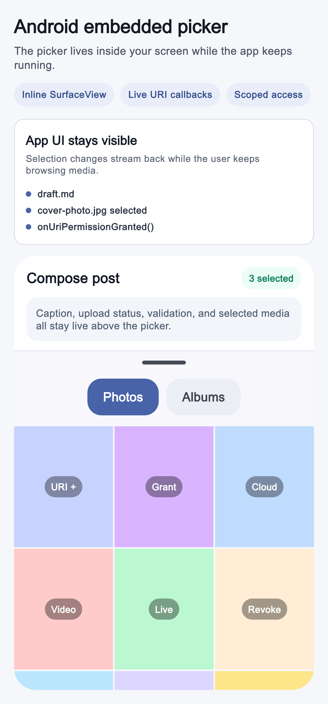
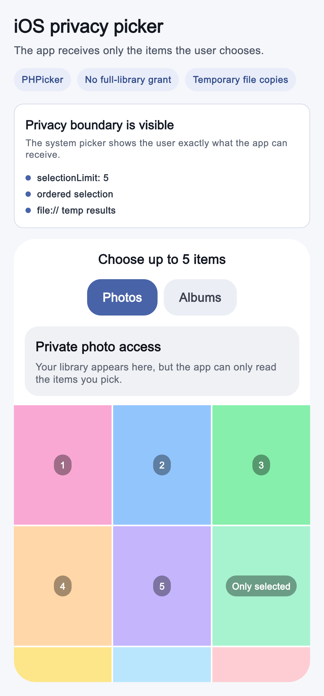

# embedded_media_picker

A Flutter plugin for Android's embedded photo picker, with Android and iOS
modal picker fallbacks.

## Platform support

| Platform | Embedded picker view | Modal fallback |
| --- | --- | --- |
| Android | Android 14+ with U Extension 15+ | Yes |
| iOS | No | Yes, via `PHPickerViewController` |

Android embedded picker support uses
`androidx.photopicker:photopicker:1.0.0-alpha02`. Treat the embedded Android
surface as early-stage until AndroidX publishes a stable artifact.

## Feature Highlights

| Android | iOS |
| --- | --- |
|  |  |

Android shows the newer embedded picker surface: the picker can live inside the
app UI while selected URI grants and revocations stream back in real time. iOS
shows the privacy-focused picker flow, where the app receives only the selected
items instead of broad photo library access.

Raw native captures are kept at `example/screenshots/native-android.png` and
`example/screenshots/native-ios.png`. Selected-result screenshots are kept at
`example/screenshots/selected-android.png` and
`example/screenshots/selected-ios.png`.

Regenerate feature screenshots with
`flutter test tool/render_feature_screenshots_test.dart --update-goldens` from
the `example` directory. Regenerate selected-result screenshots with
`flutter test tool/render_screenshots_test.dart --update-goldens`.

## Pick media

```dart
const picker = EmbeddedMediaPicker();

final items = await picker.pickMedia(
  options: const EmbeddedMediaPickerOptions(
    maxSelectionLimit: 5,
    orderedSelection: true,
    persistablePermissions: true,
  ),
);

for (final item in items) {
  print('${item.uri} ${item.mimeType} ${item.sizeBytes}');
}
```

`pickMedia()` returns `PickedMedia` objects:

- `uri`
- `type`
- `mimeType`
- `fileName`
- `sizeBytes`
- `isTemporary`

On iOS, `PHPickerViewController` results are copied into the app temporary
directory and returned as `file://` URIs, so `isTemporary` is true.

## Embed the Android picker

Use `EmbeddedMediaPickerView` only when
`isEmbeddedPickerAvailable()` returns true:

```dart
final controller = EmbeddedMediaPickerController();
final embeddedAvailable = await const EmbeddedMediaPicker()
    .isEmbeddedPickerAvailable();

if (embeddedAvailable) {
  EmbeddedMediaPickerView(
    controller: controller,
    options: const EmbeddedMediaPickerOptions(
      mediaType: EmbeddedMediaType.imageAndVideo,
      maxSelectionLimit: 5,
      orderedSelection: true,
      accentColorArgb: 0xff6750a4,
    ),
    onSelectionChanged: (items) {
      // Android returns content:// URIs with picker-granted access.
    },
    onSelectionComplete: () {
      // User tapped the picker completion action.
    },
    onError: (code, message) {
      // Handle unsupported versions or embedded picker session errors.
    },
  );
}
```

The controller provides state and streams:

```dart
controller.selectionChanges.listen((items) {});
controller.permissionGrants.listen((items) {});
controller.permissionRevocations.listen((items) {});
controller.errors.listen((error) {});
```

## Permissions

This package does not request broad photo library permissions.

On Android fallback requests, set `persistablePermissions: true` to ask the
plugin to persist read access when the system returns persistable document
URIs. Android embedded picker grants and revokes item access as the user
selects or deselects media.

On iOS, move or copy temporary files if the app needs long-term retention.
